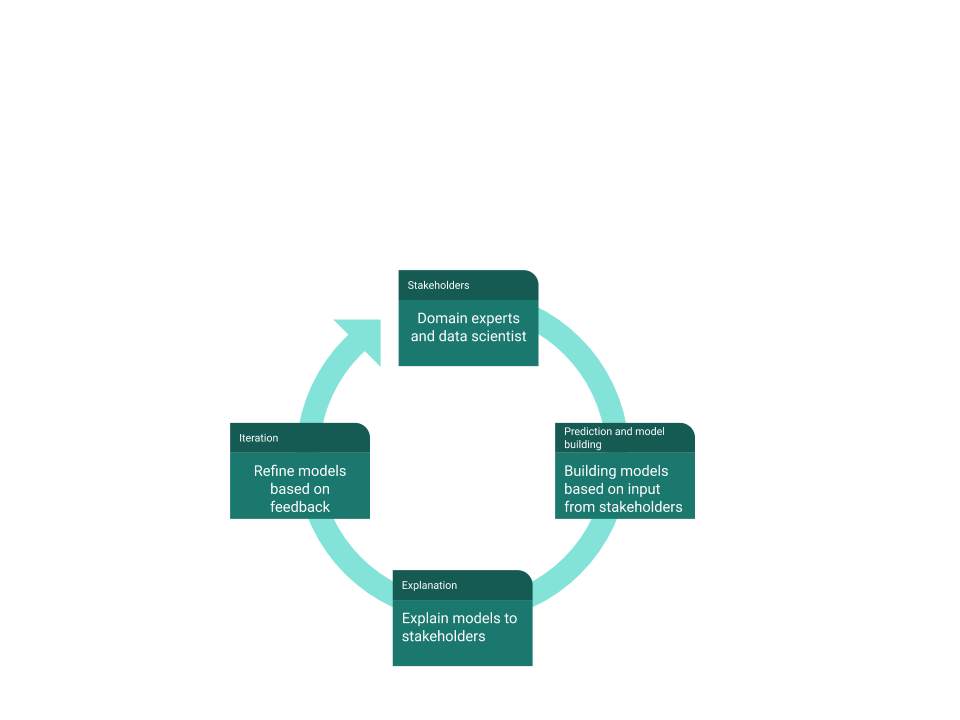

# README #

Open source code and data for open source data science.

List of projects

1) university_sexcrimes

    Analysis of data on sex crimes in US university campuses.

2) heart_disease_risk_prediction

    Predicting heart disease risk from open data.

3) cancer_mortality_prediction

    Predicting cancer survival using logistic regression from open data.

4) predicting_news_popularity

    Predicting popularity of news articles from open data.

5) opensource_mapping_project

    Open source mapping project. 

6) astroinformatics
    
    Analysis of astronomy data using machine learning techniques.

7) scientific_collaboration

    Project to analyze planetary scale scientific collaboration data.

8) accident_prediction

    Road accident forecasting and data exploration project.
    
    Interactive website using shiny at:
    
    https://neelsoumya.shinyapps.io/accident_prediction/

9) patterns_in_crime

    Predicting patterns of crime using data science. Larger cities have disproportionately more crime per capita compared to smaller cities (super-linear scaling of crime). We used techniques from dynamical systems and complex systems to explain the super-linear scaling of crime in cities and other socio-technological systems

10) spam_classification

    Building an SVM based spam classifier trained on data from the UCI repository
 
11) breast_cancer_prediction

    Downloads data from the UCI machine learning repository to make predictions
    for breast cancer. A few features turn out to be really important for prediction like epithelial cell size. This uses a random forest.

12) funding_trends_science

    Project to analyze data on funding trends in biomedical science.

13) infectious_disease_prediction

    Project to analyze data on emerging infectious diseases.

14) forecasting_imports

    Project to forecast imports and model supply chains.  

15) deep_learning_basic

    Basic deep learning model using keras for prediction.
   
16) ai_healthcare

    Machine learning and AI applied to healthcare.
    
17) ai_social_good

    Machine learning, data science and AI for social good. 
    
18) ai_bigdata_biology

    Machine learning and bioinformatics for big data in biology. 

19) browser_based_data_science

    Browser based data science for democratic access to data science tools.	
    
20) clinical_informatics

    Open source privacy-preserving clinical informatics.
    
21) policy_paper_general_public

    Policy paper for general public on Ethical Artificial Intelligence (EAI) for social good.
    
22) nlp

    Resources, code and data for natural language processing.
    
23) self_organising_map_wine_dataset

    A self organising map (SOM) on the UCI wine dataset using the Orange data science tool. 
    
24) outreach

    Outreach for machine learning and AI for general public
    
25) teaching_resources

    Teaching resources for machine learning, data science and AI for a general audience

### What is this repository for? ###

* Quick summary
	* Open source code and data for open source data science.
	
* If you use this code, please cite the paper and code
     
     * Citizen Data Science for Social Good: Case Studies and Vignettes from Recent Projects https://doi.org/10.13140/RG.2.1.1846.6002

     * Citizen Data Science for Social Good in Complex Systems, Interdisciplinary Description of Complex Systems, 16(1):88-91, 2018  http://indecs.eu/index.php?s=x&y=2018&p=88-91	
     
     * Banerjee, Soumya. (2017, September 3). Citizen Data Science for Social Good: Case Studies and Vignettes from Recent Projects (Supplementary Resources). Zenodo. http://doi.org/10.5281/zenodo.883783

      

* These projects are an example of my approach to data science for good. I work very closely with domain experts and stakeholders and use computational tools for good. I outline my design and work philosophy below.

     * 

* Installation

     * pip3 install -r requirements.txt   

* Contact

     * Soumya Banerjee
     
     * https://sites.google.com/site/neelsoumya/
     
